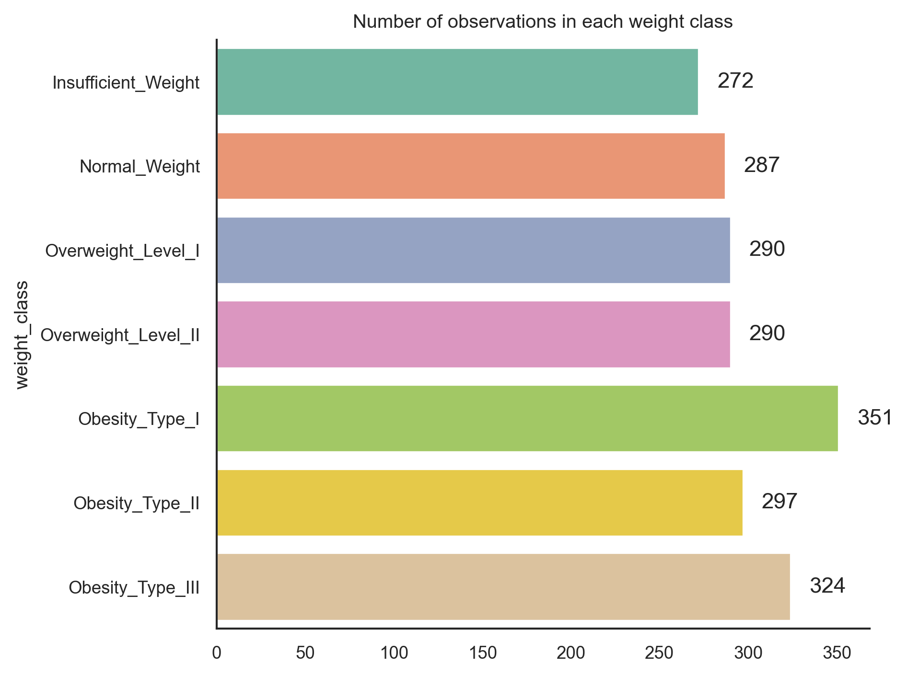
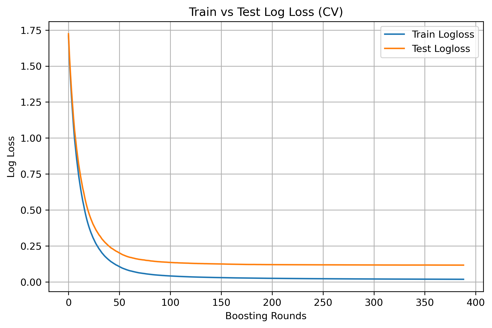
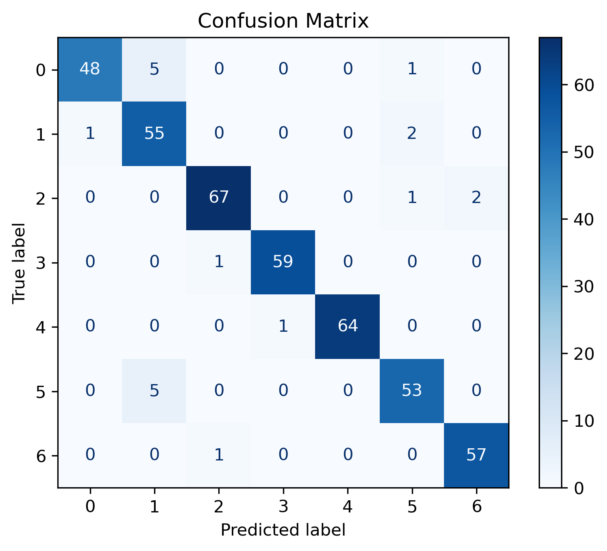
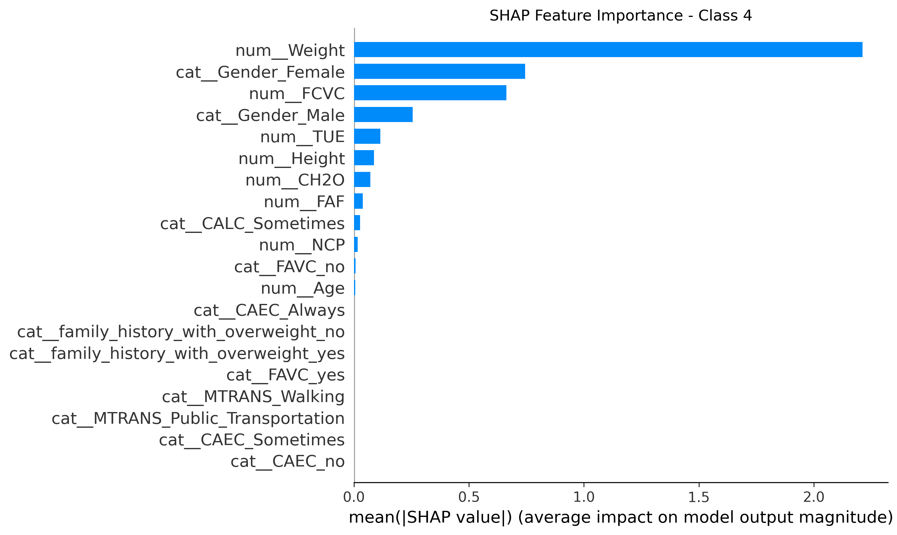
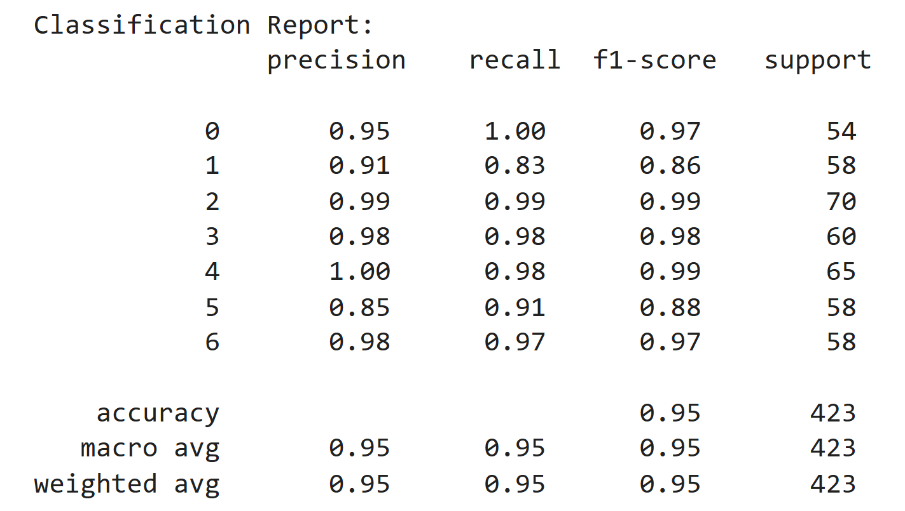
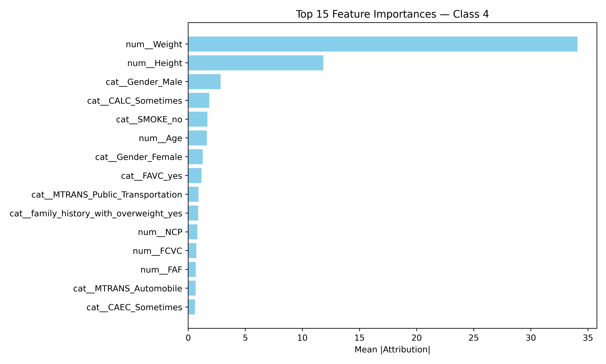

# Estimation of obesity levels based on eating habits and physical condition 
## Cohort: 7, Team: ML10

## Members

- [Eka Dwipayana](https://www.linkedin.com/in/eka-dwipayana/)
- [Olalekan Kadri]()
- [Rameez Rosul]()
- [Shefali Lathwal]()
- [Suni Bek](https://github.com/sunibek)
- [Vinushiya Shanmugathasan]()

# Contents
- [Overview](#overview)  
- [Business Objective](#business-objective)  
- [Dataset Details](#dataset-details)  
- [Potential Risks and Uncertainty](#potential-risks-and-uncertainty)  
- [Methodology](#methodology)  
- [Git Structure](#git-structure)  
- [Technical Stack](#technical-stack)  
- [Task Assignment](#task-assignment)  
- [Exploratory Data Analysis](#exploratory-data-analysis)  
- [Model Development and Evaluation](#model-development-and-evaluation)  
- [Conclusions and Future Directions](#conclusions-and-future-directions)  
- [Team Videos](#team-videos)
- [References](#references)

# Overview
We have access to a dataset of 2111 individuals that records their obesity Level along with 17 attributes related with eating habits, physical condition, and demographics.

## Business Objective
World Health Organization (WHO) is interested in understanding key features associated with obsesity levels in three different locations - Mexico, Peru and Colombia. Using the provied dataset, we want to understand the main factors that contribute to obesity levels. Once the top factors are identified, WHO can make a decision about focusing educational initiatives and allocating financial resources towards the identified factors in order to achieve the most improvement in health outcomes.

Therefore, the key deliverable for us is the list of top 3 factors that are most strongly correlated with obesity levels.

## Dataset details

The data consist of 2111 individuals with 17 attributes recorded for each individual. The list of attributes is as follows:
| Variable Name | Type | Description | Category |
 | --- | --- | --- | --- |
 | Gender | Categorical | - | Demographic |
 | Age | Continuous | - | Demographic |
 | Height | Continuous | - | Other |
 | Weight | Continuous | - | Other |
 | family_history_with_overweight | Categorical | Has a family member suffered or suffers from overweight? | Family History |
 | FAVC | Categorical | Do you eat high caloric food frequently? | Eating Habits |
 | FCVC | Integer | Do you usually eat vegetables in your meals? | Eating Habits |
 | NCP | Continuous | How many main meals do you have daily? | Eating Habits |
 | CAEC | Categorical | Do you eat any food between meals? | Eating Habits |
 | SMOKE | Categorical | Do you smoke? | Lifestyle |
 | CH2O | Continuous | How much water do you drink daily? | Eating Habits |
 | SCC | Categorical | Do you monitor the calories you eat daily? | Eating Habits |
 | FAF | Continuous | How often do you have physical activity? | Lifestyle |
 | TUE | Integer | How much time do you use technological devices such as cell phone, videogames, television, computer and others? | Lifestyle |
 | CALC | Categorical | How often do you drink alcohol? | Lifestyle |
 | MTRANS | Categorical | Which transportation do you usually use?| Lifestyle |
 | NObeyesdad | Categorical | Obesity level | Target |
 
## Potential risks and uncertainty
- Some important factors such as genetic pre-disposition to obesity, presence of diabetes, etc. are missing from the data and will therefore be ignored.
- While the models will tell us the most important features that predict obesity, the relationships are not necessarily causal, which means that improving that factor may not reduce obesity levels.
- BMI (weight/height^2) has been used to define the target categories, and both weight and height have also been included in the data as predictors. From our initial analysis, we see that weight is the most important predictor for each category as expected. Therefore, it's unclear if weight and height should be included as predictors.
- Any insights we draw from these data will be geographically limited to Latin America and not transferable to other geographies.
- Only 23% data are directly collected from people, the rest have been synthetically generated. Synthetic data may not be representative of the real population.
- We have 7 categories in our target variable. Some of these may be hard to distinguish.
- Some of the variables in the data are self-reported and may contain biases inherent in self-reported data. For example, a variable like FAVC (Do you eat high caloric food frequently?) is difficult to self-assess and report accurately.

# Methodology
The overall plan to tackle the project is as follows:

1. **Exploratory Data Analysis (EDA)**: understand each feature, explore relationships between features, understand class imbalances, analyze any missing data, and to generate ideas for feature engineering and data-pre-processing.
2. **Unsupervised analysis**: perform unsupervised clustering of data and analyze the key features contributing to each cluster.
3. **Develop and evaluate predictive ML models**:
    - Create a baseline logistic regression model
    - Evaluate the performance of the model using metrics such as precision, recall, and confusion matrices.
    - Finetune baseline model and try other algorithms such as Random Forest Classifier and XGBoost classifier
    - Compare performance of the more complex models with the baseline model.
4. **Choose the best model**: Compare performance of different models to choose the best one, calculate feature importance of input features
5. Make recommendations and suggestions for the executive team at WHO.

## Git structure

```
├── data
├──── raw
├── experiments
├── models
├── images
├── README.md
└── .gitignore
```
* **Data:** Contains the raw data. 
* **Experiments:** A folder containing ipython notebook for data exploration and experiments.
* **Models:** A folder containing the final trained model
* **Images:** Contain all images used in the README.md file
* **README:** This file!
* **.gitignore:** Files to exclude from this folder (e.g., large data files).

## Technical stack
- scikit-learn library to fit and evaluate supervised and unsupervised ML models.
- pandas and numpy: to load and explore the dataset and basic data manipulations
- matplotlib: to create visualizations

## Task assignment
- Shefali Lathwal: Exploratory data analysis
- Suni Bek: Exploratory data analysis
- Rameez Rosul: Unsupervised data analysis
- Olalekan Kadri: Baseline logistic regression and experiments (including SHAP analysis)
- Vinushiya Shanmugathasan: Experiment with Random Forest model (including SHAP analysis)
- Eka Dwipayana: Experiment with XGBoost and Neural Network models (including SHAP analysis)

## [Exploratory data analysis](https://github.com/slathwal/obesity-estimation/blob/main/experiments/data_exploration_and_visualization.ipynb)

### Dataset overview
- The dataset contains 1 target variable, NObeyesdad, and 16 feature variables
- There are a total of 2111 data points.
- 8 features are of type object, and 8 features are of type float
- There are no missing values in any variable
- The target category consists of seven different weight classes. The classes and number of participants in each class are shown below.


### Key observations
- People with a family history of obesity are much more likely to be overweight or obese, especially in the higher obesity classes. Those without a family history are mostly normal weight or underweight.
- People who usually walk instead of other means of transportation tend to have normal weight, and people who use automobiles tend to belong to higher weight categories.
- How often someone drinks alcohol does not seem to be related to weight class.
- People who "sometimes" eat between meals tend to belong to higher weight categories, and ones who report eating between meals "frequently", and "always" tend to have normal weight or insufficient weight. This might point to a bias in self-reported survey metrics where people who belong to higher weight categories, might tend to underestimate how often they eat between meals.
- There are only 44 people who report smoking out of 2111 in the survey, which is a much lower percentage that would be expected based on public health surveys.
- Height and weight have a correlation of 0.46. No other features have signification correlation with each other.

### Possible biases in the data due to synthetic data generation
- Classes Obesity_Type_II and Obesity_Type_III have very skewed gender distributions - There are only two female participants in Obesity_Type_II and only one male participant in Obesity_Type_III.
- All age ranges are not equally represented in each class. For Obesity_Type_III, Insufficient_Weight, and Normal_Weight in particular, the age range is quite narrow, compared to the other four classes, indicating possible bias in the data.
- For Obesity_Type_III, we also see two distinct groups with weight, which is different from all other classes and may indicate issues with synthetic data generation.
- Most of the synthetic data generated belong to Obesity_Level_II and Obesity_Level_III classes, which is the possible reason that there is a gender skew, two distinct weight groups and two distinct age groups in these classes. Therefore, any interpretation on these two classes may not be reliable.

### [Unsupervised analysis](https://github.com/slathwal/obesity-estimation/blob/main/experiments/Unsupervised%20Clustering_Final.ipynb)
Clustering Summary (K-Prototypes)
This project applies K-Prototypes to group individuals based on lifestyle behaviors. Although clustering is unsupervised, the groups show alignment with obesity categories.

Cluster Insights 
Cluster 0 — Active & Balanced
Features: FAF (activity), NCP (meal count), Age
Pattern: High activity, diverse weight outcomes
Dominant class: Insufficient Weight
Insight: Health-conscious and active.

Cluster 1 — Moderate Activity, Overweight-Prone
Features: NCP, Age, FAF
Pattern: Slightly low activity, moderate lifestyle
Dominant class: Overweight Level I
Insights: Possible early-stage overweight,opportunity for preventive habits.

Cluster 2 — Low Hydration, Obesity II
Features: Age, CH₂O (water intake), FAF
Pattern: Older group, low hydration + low activity
Dominant class: Obesity Type II
Insights: overweight; hydration and activity are factors.

Cluster 3 — Inactive & Severely Obese
Features: FAF (very low), NCP, Age
Pattern: Lowest physical activity
Dominant class: Obesity Type III
Insights: High-risk group 


## Model Development and Evaluation

### Model 1: [Logistic Regression](https://github.com/slathwal/obesity-estimation/blob/main/experiments/Logistic_regression.ipynb)
- The experiment was conducted by splitting the dataset into training and test dataset, stratified. Logistic regression
model was used. With accuracy of 88%, the following feature importance were found:
1. Top 3 important features for Insufficient_Weight are : Weight, Height and Age
2. Top 3 important features for Normal_Weight are : Weight, Height and CAEC_sometimes
3. Top 3 important features for Obesity_Type_I are : Weight, Height and FCVC
4. Top 3 important features for Obesity_Type_II are : Weight, Height and Gender_Male
5. Top 3 important features for Obesity_Type_III are : Weight, FCVC and Gender_Male
6. Top 3 important features for Overweight_Level_I are : Weight, Height and FCVC
7. Top 3 important features for Overweight_Level_II are : Gender_Male, Age and FCVC

Note that weight or height is common important feaures to all target classes except overweight_Level_II. This is an 
insight that needs to further checked with other models to see if the same pattern is repeated.

### Model 2: [Random Forest](https://github.com/slathwal/obesity-estimation/blob/main/experiments/random_forest.ipynb)
- The second experiment involved training a random forest model, where the accuracy was about 93%.
- The top three features that highly impacted the overall model are the following:
    - Weight, FCVC and age
- These are the top three features which impacted each class:
    - Class 0 - Insufficient Weight: weight, age, family history with overweight
    - Class 1 - Normal Weight: weight, CAEC_sometimes, age
    - Class 2 - Obesity Type I: weight, FCVC, height
    - Class 3 - Obesity_Type_II: weight, age, gender_male
    - Class 4 - Obesity_Type_III: weight, FCVC, gender_male
    - Class 5 - Overweight_Level_I: weight, age, FCVC
    - Class 6 - Overweight_Level_II: weight, age, height

### Model 3: [XGBoost](https://github.com/slathwal/obesity-estimation/blob/main/experiments/Obesity_Classification_with_XGBoost.ipynb)
- The third model performed XGBoost, where the accuracy was around 95.27% with no sign of overfitting (by tightening the regularization).
- The process of classification was import all the libraries required, read dataset, map the target, do train tes split, create pipeline that scaling the numerical features and do one hot encoding for categorical features, do hyperparameter tunning to find the best parameters value based on model's performance, train the final model with the best parameters value and calculate all the metrics. The train versus testing loss is shown in the following image, where the decrease of train loss is followed by the decrease of testing loss. It means there is no sign of overfitting.

<p align="center">
  
</p>

- The result of model metrics is detailed with confussion matrix as follows:

<p align="center">
  
</p>
  
- The SHAP feature importance showed:
1. Top 3 important features for Insufficient_Weight are : Weight, Height and Age
2. Top 3 important features for Normal_Weight are : Weight, Height and CH2O
3. Top 3 important features for Obesity_Type_I are : Weight, Height and FCVC
4. Top 3 important features for Obesity_Type_II are : Weight, Height and CH2O
5. Top 3 important features for Obesity_Type_III are : Weight, Gender_Female and FCVC
6. Top 3 important features for Overweight_Level_I are : Weight, Height and FCVC
7. Top 3 important features for Overweight_Level_II are : Weight, Age, Height

The plot of SHAP feature importance for Obesity Type III class is presented as follows:



### Model 4: [Neural Network with PyTorch](https://github.com/slathwal/obesity-estimation/blob/main/experiments/Obesity_Classification_with_PyTorch.ipynb)
- The third model carried out Nural Network with PyTorch, where the accuracy was around 95.27% with no sign of overfitting (by tightening the regularization with dropout rate optimization).
- The process of classification was import all the libraries required, read dataset, map the target, do train tes split, create pipeline that scaling the numerical features and do one hot encoding for categorical features, create PyTorch dataloader, create neural network architecture, assign optuna for hyperparameter tunning to find the best parameters value based on model's performance, train the final model with the best parameters value and calculate all the metrics. The calculation of all metrics through all classes is demonstrated bellow:

<p align="center">
  
</p>

- The result of model metrics is detailed with confussion matrix as follows:

<p align="center">
  
</p>
  
- The SHAP feature importance showed:
1. Top 3 important features for Insufficient_Weight are : Weight, Height and Family_History_with_Overweight_Yes
2. Top 3 important features for Normal_Weight are : Weight, Height and CAEC_Sometimes
3. Top 3 important features for Obesity_Type_I are : Weight, Height and CAEC_Sometimes
4. Top 3 important features for Obesity_Type_II are : Weight, Height and Age
5. Top 3 important features for Obesity_Type_III are : Weight, Height and Gender_Male
6. Top 3 important features for Overweight_Level_I are : Weight, Height and Family_History_with_Overweight_Yes
7. Top 3 important features for Overweight_Level_II are : Weight, Age and Family_History_with_Overweight_Yes

The plot of SHAP feature importance for Obesity Type III class is presented as follows:



### Models Summary
The resume of all 4 models performance are detailed as follows:

<div align="center">
 
| Model | Accuracy | Precision | Recall | F1-Score|
 | --- | --- | --- | --- | --- |
 | Logistic Regression | 88.00 | 88.00 | 88.00 | 88.00 |
 | Random Forest | 93.14 | 94.00 | 93.00 | 93.00 |
 | XGBoost | 95.27 | 95.49 | 95.27 | 95.31 |
 | Neural Network | 95.27 | 95.13 | 95.15 | 95.09 |
 
</div>

# Conclusions and Future Directions
- Eating (and water-drinking) habits occur most frequently as the key factors.  
- Education resources and funding should be dedicated to nutritional programs and improving access to healthier food options.  
-Promote water intake over soda, sweetened drinks, and alcohol\
-Increase access to fruits and vegetables\
-Decrease access to high-calorie, low-nutrient foods  
- We observed biases in the data likely due to synthetic oversampling. Therefore, WHO should allocate more resources to collecting more representative data from the general population.


# Team Videos

| Video Link |
|---|
| [Eka Dwipayana Video](#) |
| [Olalekan Kadri Video](https://drive.google.com/file/d/1JeecngIx4_JM-vthobhPnIUwQLG9YjfW/view?usp=sharing) |
| [Rameez Rosul Video](https://drive.google.com/file/d/1PuevQ25L0jKO7Kzo0ty44zF79Y9gxwNQ/view?usp=sharing) |
| [Shefali Lathwal Video](#) |
| [Suni Bek Video](https://drive.google.com/file/d/1B0kqVVtUpVRx3XYEIl_wtFfS-5cJAi3R/view?usp=drive_link) |
| [Vinushiya Shanmugathasan Video](#) |

# References
- [Dataset](https://archive.ics.uci.edu/dataset/544/estimation+of+obesity+levels+based+on+eating+habits+and+physical+condition) has been sourced from UC Irvine Machine Learning Repository
- [Publication](https://doi.org/10.1016/j.dib.2019.104344) linked to the dataset
